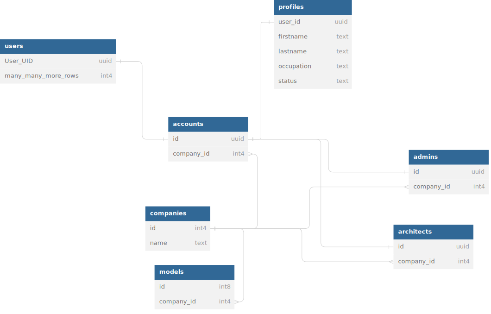

# Floorspaces
A live map of your organizations' building integrating with applications, data, and your business' software in total.

### Overview:

We have laid out and connected each part of the system on the web, being able to talk from the frontend, backend, IBM Cloud Object Storage, Supabase SQL storage, and the Unity HTTP Request library. Given the benefits of Unity as a cross-platform game engine, we can similarly use that to benefit our app for businesses. `Floorspaces.io` looks to build a platform where organizations give the architect's hat to any normal employee in their company to design floorplans. These floorplans we call "floorspaces", as the designs compile as high-performance graphical interfaces into the `Floorspaces.io` platform. 

### React + Next.js Frontend

Hosts all client side interfaces, as well as WebGL builds of our Unity interfaces. Through this combined interface we are able to use React itself or Unity to talk to our backend.

### .NET Backend

Connects Supabase, IBM Cloud Object Storage, the Unity interfaces, and React. A monolith for sure.

#### Development Profile

dotnet run

#### Production Profile (Only Works on Linode Server w/ SSL Certificate

backend]# dotnet run --launch-profile https

### Supabase DB

Contains tables for the companies and users of floorspaces, allows for business use.

### Integrating Designs on Floorspaces.io with Business Data & Applications

The ability to host such a game engine on any device, while sending and recieving HTTP requests with our .NET backend, affords us the opportunity to integrate any web service we or someone else creates. This open communication - between authenticated systems - allows us to make interactive, live, 3d maps with endless opportunities for features, finer graphical details through game design, and fitting the needs of a diverse amount of industries. Integrations proposed in the future:

- Create a public facing API with authentication keys (alike how we do with Supabase/IBM), allowing customers to render their own data on our live floorspaces.
- Create an on-premises solution for companies to not have to use our cloud services.
- Create our own messaging system between users.
- Allow for fullest MS Teams integration as possible to allow people to chat through the cross-platform interface in interesting ways.
- Integrate with or (more likely) create an HR/Payroll system alike Workday for heavily extended map features.
- Generally present as many options for integration as possible for businesses in the future, whether they'd like on-premises or cloud solutions.

### A High-Detail Map Designer, Endless Opportunities to Expand Unity Interfaces

Alternatively, there's a lot of work to be done in the Unity side as to offering the highest possible experience for these customers. With the powerful game engine and its ability to make even AAA games, we can focus on endless features to make the idea of creating a floorspace appealing, like rendering people, furniture, and various complex elements relating more to a home builder / architectural game to make the user experience fun, rewarding, and productive.

Creating a desktop version of the Floorspaces.io platform in the future allows for both the aforementioned on-premises solution and the ability to release the floor designer as standalone software, if and only if it offers value in some way to people actually looking to design homes and builings with free software. If we go deep down the direction of allowing complex archiectural and interior design features, we can ship a standalone game with Unity and put it on the Steam store, etc. to gain an initial audience. 

The balance between charging and not charging for a proposed standalone architectural builder with the floorspaces software has some tradeoffs. We can make some money to burn, pocket, or advertise Floorspaces overall with charging on Steam, but then we lose the ability for more people to demo it freely. This is why its likely best to ship the software with some core features free and possibly later monetize parts of the game in some way, but really its easier to charge people a small upfront cost than find a complex monetization scheme for a *home building game* i mean The Sims is different, SecondLife is different because those are real games rather than architectural software in the end. We maybe can demo it personally for people interested in the Floorspaces platform for their business as a start.
